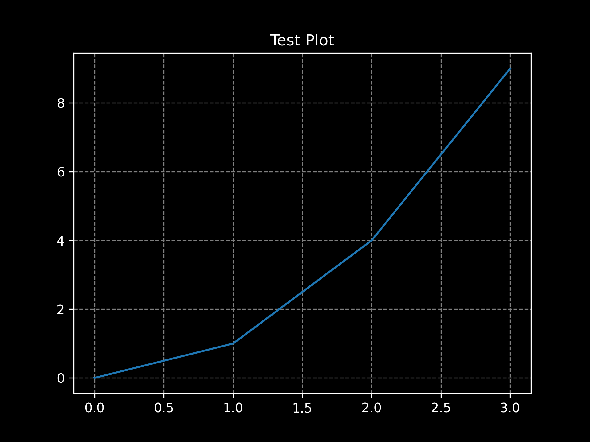

# Matplotlib Dark Theme Configuration
Easily set a dark theme as the global default for your Matplotlib plots with this custom matplotlibrc file.

# Installation
Locate Your Matplotlib Configuration Directory

Run the following command in a Python interpreter to find the directory:

python
import matplotlib
print(matplotlib.get_configdir())

# Download the matplotlibrc File

Get the matplotlibrc file from this repository.
Place the File in the Configuration Directory
Copy the matplotlibrc file into the directory identified in step 1.

# Usage
Restart your Python environment to apply the changes. All Matplotlib plots will now use the dark theme by default.

# Example 1
python3

import matplotlib.pyplot as plt

plt.plot([0, 1, 2], [0, 1, 4])
plt.title('Dark Theme Test Plot')
plt.show()

# Example 2

Run test_plot.py from this repo
python3 test_plot.py > test_plot.log & 

The output should look something like this:

# Customization
Change settings to suit preferences
